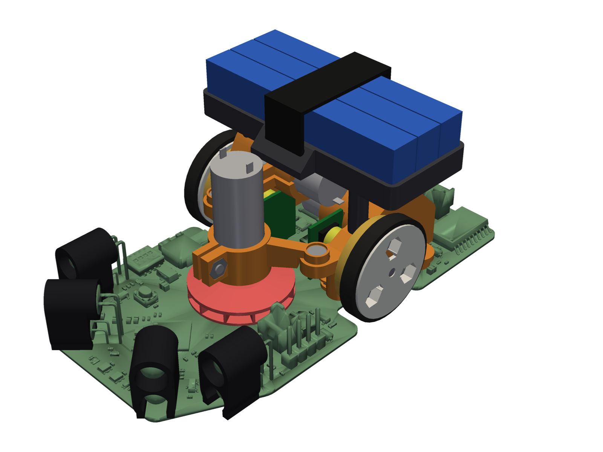
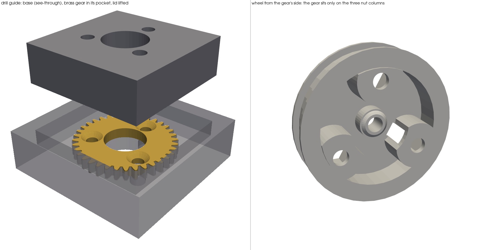
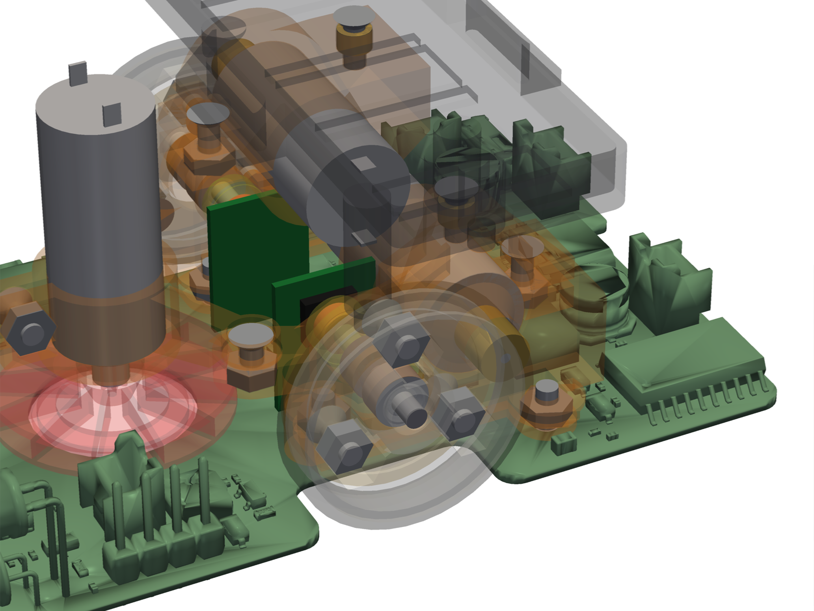

# Micras chassis

A parametric chassis for the Micras micromouse, written as [build123d](https://github.com/gumyr/build123d) code. Every dimension lives in `micras/params.py` and in the `*Params` dataclasses at the top of each part module. Change a value, then rerun the checks and the exports.



The previous design (SolidWorks parts and assembly) was removed from the tree; it is in the git history (`git show 1307880:MicrasAssembly.STEP`).

## Workflow

```sh
uv sync                                   # Python 3.12 environment
uv run tools/export_board.py              # re-import the board after it changes in ../hw_debug (needs Windows KiCad); the wall sensors get the datasheet LED models of micras/leds.py (--original-sensors keeps the embedded model)
uv run pytest -q                          # design rules: clashes, board contact zones, LED fit, CoM over the axle
uv run tools/show.py                      # send the model to the OCP CAD Viewer, grouped, with the real board and its silkscreen (--simple: boxes)
uv run tools/render.py out.png --view iso --extra micras.assembly:printed          # the README's render (docs/render.png)
uv run tools/render.py out.png --dir=0.5,1,0.75 --focus=-5,13,14 --zoom 3 --extra micras.assembly:printed \
    --hide cell,velcro,sensor_cap --ghost block,fan_mount,basket,wheel,magnet_cup,impeller,tire   # docs/render_inside.png
uv run tools/export.py                    # build/print/<group>/*.stl (turned to print), build/print/parts.md, build/micras.step, build/skirt.dxf|svg
uv run tools/slice.py [plate ...]         # build/sliced/*.pm4n (Photon Mono 4) and *.gcode (Ender 3 V3 SE); see docs/printing.md
uv run tools/mass_report.py               # mass, centre of mass, yaw inertia, battery position for balance
uv run tools/battery_study.py             # compare battery arrangements
uv run tools/check_gears.py [--png f]    # printed gear pair (the alternative), and the printed wheel with the brass pinion: mesh through a tooth pitch, backlash, binding distance, tooth stress
uv run tools/fea.py [part ...] [--png]    # structural check of the printed parts (about 13 min for all, 1-3 min per part)
```

Run heavy jobs through `tools/capped.sh`, for example `tools/capped.sh uv run tools/export.py`. It caps memory at 6 GB so that a runaway job gets killed instead of crashing WSL.

**Structural check.** `tools/fea.py` meshes each printed part with gmsh and solves linear elasticity with scikit-fem (quadratic tets, pyamg solver) under rough worst-case loads: a 1 m/s crash into a wall (100 g), a 30 cm drop onto the wheels (300 g), side hits, handling pushes and the impeller's spin. It reports the stress exceeded in only 0.1 % of the volume (the raw peak sits in sharp corners, where linear FEA does not converge) against printed-material strengths (resin 35 MPa; PLA 37 MPa along its layers and 15 MPa across them, using the print orientation; TPU 8.6 MPa), and flags anything under a safety factor of 2 (3 for sustained loads). A flag means "look here": the loads are estimates. It runs on the CPU (about 5 GB at most); run it through `tools/capped.sh` with `MEM=5G`. `--dry` only meshes the parts and checks that every support and load finds its faces (seconds).

**Robot frame.** The same frame as the firmware: the origin is on the floor under the midpoint of the wheel axle, x points forward, y points left and z points up, in millimetres.

## Parts

| Module | Parts | Material |
|---|---|---|
| `drive.py` | bearing blocks (base + cap per side, or one piece) with the outer bearing's tube, magnet cups, wheels (gear, drum and end web in one piece) | resin |
| `fan.py` | closed radial impeller (Ø22, eye 10, 12 blades, neck into the board hole); the fan mount, a yoke hung from the drive caps with a split collar clamp | resin |
| `frame.py` | battery basket on two posts onto the drive caps, held shut by a velcro strap | PLA |
| `leds.py` | SFH 4550 and TPS601A models from their datasheets (they replace the board model's hand-drawn LEDs) and the numbers the caps are built from | – |
| `gears.py` | printed gears (0.5M 7T pinion, the 36T gear of the wheel), generated with py_gearworks: the alternative to the brass pair (`Gears.wheel_gear = "printed"`) | resin |
| `gear_guide.py` | drill guide for the brass 36T: its bore opened to Ø7.8 and three Ø2.2 holes on Ø12.3 | resin |
| `front.py` | four wall-sensor caps that stand on the footprint outlines and set the LEDs' aim | black PLA |
| `skirt.py` | skirt cutting pattern (0.05–0.1 mm PET or Kapton film) | film |
| `fasteners.py` | the M2 screws, nuts and inserts in place, from the same helpers that cut their holes (viewer, STEP, `check_layout.py`) | bought |
| `skids.py` | where the two PTFE skates go under the board's centre line, front and rear, and their size | bought (mouse skates) |

`build/parts.md` lists each part's mass and print orientation. The printed parts come to about 16 g, and the whole robot to about 79 g with its fasteners (`mass_report.py`).

## Components

The bought parts the chassis is drawn around (in `micras/params.py`, measured where noted):

| Part | Size |
|---|---|
| Drive motors (2) | coreless 1020: can Ø10 ± 0.05 × 20 ± 0.2, shaft Ø1 × 6 ± 0.3, two solder tabs 1.5 × 0.32 at 7.4 pitch on the rear face (datasheet) |
| Fan motor | Ø9.97 × 23.08 (measured), 54k rpm at 7.6 V, with a pressed-on 9T module 0.3 pinion (tip Ø3.3, 4.6 long) that stays on |
| Batteries | 3 cells, 47.16 × 11.32 × 6.45 (51 long with their leads) |
| Magnets | Ø4 × 2 (the default) or Ø6 × 2, diametrically magnetised |
| Axles | Ø2 |
| Bearings | 2 × 5 × 2.5 (measured 2.57 wide) |
| Tires | 16 inside, 2 thick, 10 long as bought: stretched onto the wheel and cut to the channel (3.2) |
| Gears | brass 0.5M 7T pinion (0.98 bore), pressed on each motor shaft flush with its end, and 36T wheel gear (a plain 2 mm disc, 1.98 bore), drilled in the printed guide (bore to Ø7.8, three Ø2.2 holes countersunk on Ø12.3) and screwed to the printed wheel |
| Screws | M2 × 5 countersunk |
| Threaded inserts | M2, 2 long, OD 3.2 (glued) |
| Nuts | M2 |
| Velcro strap | 10 wide |

## Key design decisions

- **Board contact.** Only the two L-shaped silkscreen zones carry the bearing blocks, with two countersunk M2 screws per side from below the board. Only a few other parts touch the board: the sensor caps on the casing outlines their footprints draw, and the skates stuck under it. The fan mount hangs from the drive caps and never touches the board. `check_layout.py` enforces this.
- **Encoder alignment.** The axle sits 9.00 mm above the board top, so it lines up with the AS5047U. The magnet is a Ø4×2 (the owner's default; `magnet_cup6` is the alternative cup for a Ø6×2, and the blocks' room fits either), 0.5 mm from the package face. A Ø6×2 there gives about 60 mT for N35 and 66 mT for N42 at the Hall elements when centred; the chip's window is 35–70 mT, so with an N42 magnet it must stay centred (0.3 mm off-centre adds about 20 mT). The Ø4×2 gives more field, not less (the Hall circle is near its rim): about 103–113 mT at 0.5 mm, over the window, so check the encoder's field-strength readings; at 1.3 mm it would give 54 mT N35, 59 mT N42 (`Magnet.gap = 1.3`: everything outboard moves out with it, which narrows the tire channel from 3.5 to about 2.7 mm).
- **Brass gears** (the default since they arrived). The motors carry the bought brass 7T pinions, pressed on flush with the shaft end, where the printed ones were. The bought 36T (a plain 2 mm disc) is screwed to the printed wheel, so the rest of the drive stays as it was: its bore is drilled out to Ø7.8 (the wheel's hole: 0.3 mm round the bearing tube) and three Ø2.2 holes on a Ø12.3 circle, halfway between the bore and the tooth roots (Ø16.75), are countersunk 90° on its inboard face for M2×5 flat heads. The heads sit flush, because that face runs 0.25 mm from the block (0.24 mm of brass is left between a Ø4 countersink and the bore or the roots). The screws pass the wheel's web snugly (Ø2.1), so with the countersunk heads they centre the gear, and go into M2 nuts in hex pockets that open on the wheel's outer face. Each pocket is in a column inside the hollow drum, from the end web to the gear, and the three column ends are all the gear sits on. `gear_guide.py` is the printed drill guide, square outside so it clamps in a vise: a base whose pocket has the gear's outline (0.1 mm clear of its teeth: it centres the gear and keeps it from turning), and a square lid with the drill holes that drops into a square recess above it (it can't turn either), so the holes and the bore come out concentric with the teeth and the three holes evenly spaced.


- **Printed gears** (the alternative: `Gears.wheel_gear = "printed"`). `gears.py` makes a printable pair with the brass gears' module, tooth counts, widths and centre distance. A standard 7-tooth pinion would be deeply undercut, so the pair is profile shifted (+0.45 pinion, −0.45 wheel: the centre distance stays 10.75) and the pinion's tip is cut back 0.2 module (about 0.22 mm tip land, contact ratio 1.25). They are generated with [py_gearworks](https://github.com/GarryBGoode/py_gearworks) (Apache-2.0, build123d-native: true involutes with the generated undercut, profile shift, backlash, fillets; bd_warehouse's gears have no profile shift). 0.12 mm of backlash, most of it on the wheel's wider teeth; a print error may close the centre distance by about 0.15–0.19 mm before the teeth bind (`check_gears.py`). Round 6 had 0.06 mm: both pairs printed with no play left and the left one felt heavy on every tooth, so the print fattens the teeth by about 0.06–0.09 mm in the mesh. The printed wheel gear is part of the wheel (`build/print/alternatives/wheel_printed_gear_*`); it meshes with the brass pinion too, with about 0.25 mm of backlash (its −0.45 shift isn't made up by the unshifted pinion; `check_gears.py`).
- **Bearing blocks.** Each side is one solid block, like the v1 bearing blocks: an outer plate next to the gear, whose outline is the hull of the bearing housing, the motor seat, the two cap-screw bosses and (on the left) the frame boss, with the housing and the seat running inboard from it; the frame boss is blended into the motor seat's ring. Each cap has an ear in front of its front screw for the fan mount's arm, with an M2 nut trapped underneath and a recess that the arm's tab drops into (it places the mount before its screws go in), and sockets for the basket's pegs. Shallow pockets on the plate's hidden inboard face save a little resin without adding supports. It is split at the axle plane into base and cap. The motor rings have a 1.5 mm wall (they were drawn for the old eccentric sleeves, 2.1–2.7 mm round the motor, and the raised ring set the battery's height: it now sits 1 mm lower) and run inboard to 1 mm short of the centre line, gripping 14 mm of the motor's 20 (7.4 before), each with a slot open below that straddles its encoder daughterboard; they clear the other side's motor by about 0.45 mm. The motor's front face stops on a 1 mm flat ledge at the bore's outer end, then a 50° cone narrows to the pinion's clearance (a fully flat end would be a 2.3 mm ceiling inside the bore as it prints).
- **Two drive variants.** The default (the owner's choice after round 6) is the one-piece blocks, `Layout.blocks = "solid"`: the inner bearing presses in from the inboard end up to the lip, and both motor rings are slit clamps with an M2 screw (the left one on its rear side). `Layout.blocks = "split"` gives the base + cap blocks described above. The blocks' tops are the same in both, so the basket and the fan mount fit either. `tools/export.py` writes both (`build/print/drive_<solid|split>/`); print one. The motor's fit is set per seat: `ring_motor_fit_split` (`_upper` for the raised right motor), `ring_motor_fit_solid`.
- **Print files.** `tools/export.py` turns every part to its print orientation (`assembly.PRINT`: bores vertical, supports on hidden faces) and `tools/slice.py` slices the plates headless with PrusaSlicer and UVtools, for the Photon Mono 4 (Anycubic ABS-Like Pro 2 resin) and the Ender 3 V3 SE (PLA). A calibration print (`fit_test.py`) holds every fit at a range of clearances. See [docs/printing.md](docs/printing.md).
- **Skids.** The robot stands on one axle with its centre of mass over it, so the body tips about the axle onto whatever is lowest ahead or behind each time the acceleration changes sign. Two PTFE mouse skates (0.7 mm, cut to 10 × 7 mm ovals) stuck under the board's centre line, 45 mm ahead of the axle and 26 mm behind it, are those lowest points. The board rides 1.2 mm above the floor (Ø22.48 wheels), so their faces sit 0.5 mm up with the tires unloaded; the Shore 20 tires sink about 0.35–0.5 mm under the weight plus the fan's 4 N, so with the fan on the skates run 0–0.15 mm clear, and the body can only tip a fraction of a degree before it lands on PTFE, not on the board edge. They stay off the skirt's taped band, which holds the margin that seals the gap. The fan's suction acts on the whole skirted area, which is centred 7.4 mm ahead of the axle (not at the fan hole), so with the fan on, the nose rests on the front skate (about 0.65 N) unless the robot accelerates harder than about 20 m/s². Nothing else comes near the floor when the robot tips onto either skate (`check_layout.py` FLOOR). There is no bumper: the skirt's margin runs all the way round the nose, and the diagonal sensor caps are the robot's front corners.
- **Axial stack.** Along each axle: the magnet cup, whose sleeve runs along the axle inside a room in the housing; the housing shoulder; the inner bearing; the housing lip (the block's outer face); then a tube, one piece with the base (a full ring, not split), that reaches out through the wheel's gear into the wheel's hollow drum and holds the outer bearing at its end; and the wheel, one piece (gear, drum with the tire's channel, end web), turning round the tube and glued to the axle at its end web. The bearings sit about 4.4 mm apart, so the overhung wheel is held more stiffly than with the two bearings side by side; the wheel's axle boss runs from its end web in to just past the tube's end, gripping 2.9 mm of the axle so the wheel stays square to it; and the magnet cup's sleeve is 3.4 mm long (it glues the cup to the axle). Cones on the cup and the end web bear on the inner races only: the cup pushes the inner bearing out against the lip, the end web pushes the outer bearing in against the tube's step, so the axle is held both ways and the magnet cannot be pushed into the chip. The pockets are 0.1 mm longer than the bearings (they measure 2.57, not the nominal 2.5).
- **Backlash.** The motors sit straight in their rings, so the backlash is what the print gives; `Gears.center_adjust` tunes the center distance. The eccentric sleeves (±0.3 mm of adjustment) were dropped so the rings could be thinner and the battery lower; they are in the git history.
- **Battery.** Three cells on edge, one behind the other, in an open PLA basket on two posts screwed to the drive caps' frame bosses. Its walls are 4 mm tall: they only locate the cells. A velcro strap runs over the pack front to back, down outside the walls and through a slot in a lug on the foot of the front and rear walls, and closes on itself on top, so swapping the pack takes no tools (`FrameParams.wall_h = None` gives full-height walls with two straps through windows instead). Two posts in a line across the robot would let the basket pitch in a crash, so three feet under the floor rest on the drive caps (two on the left cap, one on the right cap's motor ring), each shaped to the cap's top; the two on the left carry pegs that drop into sockets in the cap, so the basket sits in place before its screws go in. The floor is ribs with solid bands under the posts and along all four walls, and the left post flares into it (`fea.py`: 100 g crash, 100 g side crash, 300 g drop, the strap's pull). Pull the strap snug, not hard: at 5 N each side the floor next to the right post sees 7 MPa across its layers (fine short term, but printed plastic creeps; 3 N keeps it at 4 MPa; computed for PETG, PLA is a little stronger). It prints upside down, its floor on supports from the bed (the bridges alone sagged; the lugs are 45° wedges). The box is sized for cells 51 mm long with their leads (the bodies are 47.16). The edge and pyramid arrangements have the same yaw inertia; edge is 2 mm lower (`battery_study.py`). `Battery.x` puts the center of mass over the axle (`mass_report.py`).
- **Motor layout.** Both motors sit behind the axle. Moving the raised motor in front of the axle was evaluated: it lowers the pack by about 10 mm but pushes the battery 4 mm further back and raises yaw inertia by 5.5 %.
- **No car body.** An earlier version had a one-piece PETG body (battery box with a lid, a faceted nose over the fan motor, fin and rear wing) whose airbox clamped the fan motor. The open layout is about 3.5 g lighter and simpler to print and service; the car body is kept at the git tag `car-body`.
- **Wall sensors.** The SFH 4550 emitter (5 mm epoxy, ±3°) and TPS601A receiver (a TO-18 metal can with a lens and a key tab, ±10°) are modelled from their datasheets in `leds.py`; the board's own sensor model had hand-drawn LEDs, with a receiver copied from the emitter. Their beams are already narrow, so aiming them matters far more than shaping the beams: a 1.5° pitch error changes the reading by 10–40 % up close, while an aperture in front of the lenses only cuts the signal (a Ø3 aperture loses about 70 %). Each cap (black PLA on the Ender; the painted resin ones did not work, docs/printing.md) stands on the casing outline the footprint draws, and fixes the LEDs' height and pitch from the board. Crush ribs grip each LED at its flange and body (each bore sized for its own part), its base lines up on the footprint's outline (a fork around the legs, behind the receiver, would block the slide-on; `check_sensors.py` sweeps the LEDs' path), a short keyway at the back of the receiver's sleeve takes its flange tab (which fixes its roll; the tab is only on the flange, so the keyway stops just past it), and the front stays open at full lens width behind a 1 mm hood. `FrontParams.emitter_tilt` pitches the emitter towards the receiver: an optics model predicts 15–50 % more signal at 10–40 mm for 1–2°; on the bench the 2° test cap worked well, so the caps are pitched 2°. In resin 0.10 mm crush ribs gripped best; in PLA the bores have more room (0.25 mm) and the ribs 0.05 mm until the FDM test caps choose (0, 0.05 or 0.10). The sensors can't see a wall closer than about 8 mm from the caps whatever the cap does, because the emitter sits 6.5 mm above the receiver.
- **Fan.** The fan motor (Ø9.97 × 23.08, 54k rpm at 7.6 V) would spin about 87k rpm with no load at 12.3 V, so it is limited by its power and heat, not its speed (docs/fan_study.md). A Ø22 closed impeller (eye 10, channel tapering 3 to 2 mm, twelve straight radial blades from hub to tip) makes 4 N with the skirt at about 46k rpm and 2.5 W from the battery by the CFD (docs/fan_study.md; the simpler 1D model said 42.6k rpm). The CFD found the curved-inlet variant no better and the backward-curved one worse, so the radial one is the default (`FanParams.style`) and the only one in the robot print; the other two are in `build/print/alternatives/` to compare on the bench. Never run it at full voltage (79k rpm, 17 W, overheats in minutes): cap it near 7.5 V and ramp it up over 0.2 s. Two things matter more than the impeller: the fan PWM's ripple (at 100 kHz a coreless winding of about 8 µH carries about 1.1 A rms of ripple, so run TIM12 at 300–400 kHz or add a 22–47 µH inductor) and the skirt closed round the wheel notches. The impeller's hub is glued onto the motor's 9T pinion (it doesn't come off). Its front shroud runs 0.3 mm above the clean Ø27 ring (the inlet seal) and a short neck dips into the board hole; seal the skirt well and tape over the encoder slots. The fan mount is a yoke: the motor sits in a collar, clamped by a split at its top with a crosswise M2 screw into a trapped nut; two arms reach back to the ears on the drive caps (a screw into a trapped nut each). It doesn't touch the board.

## Fasteners (M2×5 countersunk, M2×2 inserts, M2 nuts)



17 screws, 2 inserts and 15 nuts in total with the default one-piece blocks and brass gears (the split blocks: 20 screws, 6 inserts and 14 nuts, with the four cap screws but no clamp on the left ring; the printed gears need none of the six on the wheels). Each head seat is placed so the 5 mm screw engages the full 2 mm of its insert, or a whole nut. `fasteners.py` places every one, and `check_layout.py` checks that none of them runs into a part (a screw too long for its hole, a nut against a bearing).

| Joint | Qty | Insert in | Notes |
|---|---|---|---|
| board → bearing-block bases | 4 | M2 nut slid into a slot beside each screw hole, 0.9 mm above the board (as in the v1 blocks) | from under the board, heads in the board's countersinks |
| caps → bases (split blocks only) | 4 | bases (resin, glued) | heads counterbored into the cap bosses |
| right motor ring clamp | 1 | M2 nut trapped under the lower clamp ear | locks the right motor |
| left motor ring clamp (one-piece blocks, the default) | 1 | M2 nut trapped under the lower clamp ear | on the ring's rear side |
| brass gear → wheel | 6 (3 a side) | M2 nut in a hex pocket in the wheel's outer face | M2×5 countersunk, heads flush in the gear's inboard face |
| basket → caps | 2 | cap bosses (resin, glued) | left one down the post, through the basket floor |
| fan mount → caps | 2 | M2 nut trapped under each cap's ear | down through the arm's tab |
| fan motor clamp | 1 | M2 nut trapped in the clamp ear | crosswise through the split collar |

No screw holds these; they're pressed, glued or clamped instead:
- brass pinions on the motor shafts: pressed (as bought)
- magnets: glued in their cups; the cups and the wheels: glued to the axles
- outer bearings: pressed into the tubes
- tires: stretched into the wheels' channels (a flange each side), no glue
- impeller: pressed onto the shaft and glued
- sensor caps: crush ribs on the LEDs, a drop of glue on the base
- skates: their own adhesive, under the board
- cells: a velcro strap

## Assembly

1. **Board.** Trim the THT leads flush on the underside: the board is only 1 mm off the floor. Tape the skirt to the underside: the inner 3 mm band gets tape, and the outer margin is bent down.
2. **Inserts and nuts.** Glue an M2 insert into each block's frame boss with CA or epoxy (heat-setting does not work in resin). Put an M2 nut in the trap under each block's fan ear, one under each motor ring's clamp ear, and one in the fan mount's clamp ear.
3. **Bearings, axles and wheels**, each block off the board:
   1. cut each axle 13.9 mm long and deburr both ends (a file or fine sandpaper, a small chamfer): rough ends jam in the bores
   2. press the inner bearing in from the inboard end (through the cup's room) up to the lip, and the outer one into the end of the tube, up to the step inside
   3. glue the magnet into its cup (pole direction as the encoder wants it) and slide the cup into its room, its sleeve towards the bearing
   4. put a drop of epoxy (or slow CA) on the axle's tip and push it in from outside, through the outer bearing and the inner bearing, into the cup until it stops on the magnet
   5. drill the brass gear in the guide (`drill_guide_base` and `_lid`): drop the gear into the base's pocket (its teeth into the pocket's teeth), the lid into the square recess on top of it, and clamp the stack in a vise under a drill press, the jaws on the base's sides and the lid held down. Drill the three Ø2.2 holes, then open the bore with drills of growing size (2.5, 4, 6, 7.8: each follows the hole before), only the last one guided by the lid. Deburr, and countersink the three holes 90° on one face until an M2 flat head sits flush or just below: that face goes inboard. Drop an M2 nut into each pocket in the wheel's outer face, lay the gear on the wheel's web, its countersunk face away from the wheel, and screw it on with three M2×5
   6. push the wheel onto its axle, over the tube, until its cone touches the outer bearing, and glue it there (hold the axle's inner end, not the block, so the force doesn't go through the balls); the cones then hold the axle both ways with no end play
   7. stretch the tire (cut to the channel's width, 3.2 mm) over the wheel's outer flange into its channel
4. **Left block.** The encoder daughterboards go into the board first: each motor ring straddles one in a slot open below. Slide an M2 nut into the slot beside each of the block's two board-screw holes (flats along the slot, until it drops over the hole), then screw the block to the board from below with M2×5 countersunk screws through the board's countersunk holes.
5. **Left motor.** The brass pinion sits flush with the shaft end. Slide the motor into the left ring from the inboard side until its front face stops on the ledge at the ring's outer end, and tighten the clamp screw (it's under the basket: tighten it before the basket goes on). Check the wheel turns with a little play at the gears.
6. **Right block and motor.** The same on the right: the block after the left one (the motors cross over the middle; the right motor's rear end lies over the left ring), then its motor, then its clamp.

   With the split blocks (`Layout.blocks = "split"`), glue inserts into the bases for the cap screws too, and screw the bases to the board first. Lay the cup, the inner bearing (in its half-pocket, against the cup's cone) and the axle in the base, as above. Lay the left motor in its base seat against the ledge and fit the left cap with two M2×5, before the right cap. Slide the right motor into the right cap's ring and tighten its clamp, then fit the cap. Then the wheels.
7. **Fan.** The impeller only works turning the way the arrow on its top points (counter-clockwise seen from the motor's side): run the motor on the bench first and swap its two leads if it turns the other way. The fan motor's 9T pinion stays on: the impeller's bore is shaped like the pinion; slide it on as far as it goes (3.8 mm), check it runs true, and wick in thin CA. Balance it: run the fan slowly, read the vibration on the robot's IMU at the rotation frequency, add a tiny drop of CA on the light side, repeat (aim for about 5 µm of imbalance). Put the motor into the fan mount collar, with its terminal tabs pointing left and right, and tighten the clamp screw. Lower the mount in: its tabs land on the blocks' ears (the caps' with split blocks); screw both tabs down.
8. **Sensor caps.** Each cap holds one LED pair: the emitter (the clear 5 mm LED) on top, the receiver (the metal can with a small tab on its rim) below.
   1. **Bend the legs first.** The caps assume the receiver's legs bend down 2.0 mm behind its flange and the emitter's 2.55 mm behind its flange, with the LEDs' axes 3.25 mm (receiver) and 9.75 mm (emitter) above the board, pointing straight along the sensor's look direction. Solder them that way.
   2. **Tape the emitter.** One wrap of electrical tape round the emitter's epoxy body, from the flange forward, not over the flange or the lens (the cap's emitter bore is 0.2 mm bigger for it: `FrontParams.emitter_tape`).
   3. **Fit the cap.** Hold it in front of the LEDs and slide it straight back along the look direction: the upper bore over the emitter, the lower over the receiver, with the slot in the lower bore lined up with the receiver's tab. Keep pushing until the bores stop on the LED flanges. Don't twist it on: that bends the legs.
   4. **Check the aim:** the cap's base should sit flat on the board (no gap under its front), lined up with the sensor's outline printed on the board, and the LEDs should look straight out of the cap. The cap has no fork round the legs (it would block the slide-on), so its sideways position and its yaw come from the LEDs and from this line-up.
   5. **Glue:** a drop of CA where the base meets the board, not on the LEDs. To remove it later, cut the glue with a blade.
9. **Basket.** Set it on the blocks: the two pegs drop into the left block's sockets. Screw it to both frame bosses (the left screw goes down its post).
10. **Battery.** Thread the velcro strap through the front and rear lugs. Put the cells in the basket and close the strap over the pack.
11. **Skids** (last, on the finished robot with the battery in, on a flat hard floor: a glass sheet or the maze). Cut two 10 × 7 mm ovals from the 0.7 mm mouse-skate sheet and round their edges with fine sandpaper. Stick them on, long side along the robot:
    - the front one centred, its front edge just behind the skirt's taped band at the nose (3.2 mm behind the board's front edge);
    - the rear one centred on the USB notch, its rear edge just ahead of the skirt's taped band.

    Run the fan at full speed and hold the tail down with a finger, so the robot tips back onto the rear skate. Then slide strips of printer paper (0.1 mm) under the front skate from the front, under the skirt's margin:
    - **one sheet doesn't pass:** the skates would take load off the tires. Sand them thinner.
    - **four sheets pass:** the robot rocks more than it needs to. Put a layer of thin tape (about 0.1 mm) under each skate.
    - **otherwise:** done.

    With the fan on and the robot left alone, the nose rests on the front skate, and the rear one is clear by about 0.6 times the gap you measured.

## Still to measure

These values are estimates in the parameters, and the design should be updated once they're measured:

- Motor front boss diameter and length.
- How far the solder tabs stick out behind the motor.
- Populated board mass, estimated at 15 g.
- The bearings' outer diameter (the split pockets were tight at 5.13; the fit bar `fit_BRG` in the calibration print checks it).
- Fits (2.5 s, docs/printing.md; check them on the parts, the fit bars if one is off; all are parameters): `bearing_fit`, `solid_bearing_fit`, `ring_motor_fit_split` (`_upper` for the raised right motor), `ring_motor_fit_solid` and `split_relief` (drive), `insert_d` (3.35 glued in resin), the nut traps' `nut_af`, `axle_fit`, the sensor caps' `rib_interf` and `slot_w` (and check on a real TPS601A which way its tab points: `Tps601a.tab_angle`, read from the datasheet's outline as up and towards pin 1).
- The impeller on the bench: the radial one (the default) for its downforce and current against the PWM duty (the scale method in docs/fan_study.md); the CFD comparison of the three styles is there too, and the other two print from `build/print/alternatives/` to compare.
- Real downforce, on a scale with the fan running (docs/fan_study.md predicts about 4 N at 6.3 V average), and for the fan motor: its winding inductance (scope across R31, the most important unknown), resistance, no-load current at 6, 9 and 12 V, and the can's temperature after a 5-minute run.
